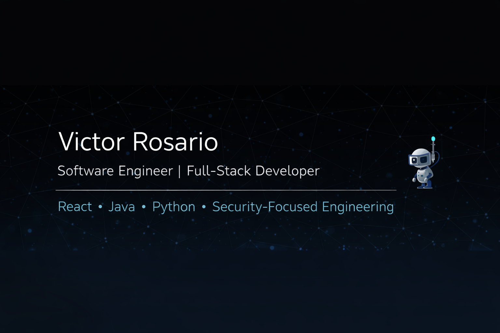

I enjoy building clean, scalable applications, interactive experiences, and tools that solve practical problems.

🌐 Portfolio: https://victor-portfolio-nu-two.vercel.app

📍 Location: United States
🔐 Clearance: Active Secret

## 🧠 Tech Stack

  

🚀 Featured Projects
🔐 Password Strength Analyzer

A live security tool that evaluates password strength using entropy analysis and rule-based scoring.

Tech: Python, FastAPI, REST, CORS

Repo: https://github.com/Vros15/password-strength-analyzer-

Live API Docs: https://password-strength-analyzer-pa5m.onrender.com/docs

🎮 Tic-Tac-Toe AI

An interactive React game featuring a Minimax-based AI opponent.

Tech: React, Hooks, Game State Logic

Repo: https://github.com/Vros15/tic-tac-toe-react-ai

🕹️ Shaq-a-Licious (Java Game)

An arcade-style Java game demonstrating object-oriented design, collision detection, and custom rendering.

Tech: Java, OOP, Game Loop

Repo: https://github.com/Vros15/Shaq-Game

📫 Let’s Connect

LinkedIn: https://www.linkedin.com/in/victor-rosario-7ba7a5231

GitHub: https://github.com/Vros15

Portfolio: https://victor-portfolio-nu-two.vercel.app

⭐ About This Profile

This GitHub highlights selected projects, experiments, and coursework that reflect my transition into professional software development.

I’m always open to collaboration, learning opportunities, and meaningful engineering challenges.
