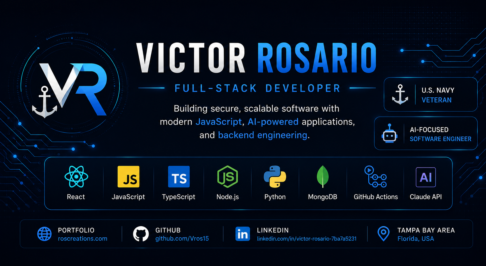

  

### Building secure, scalable software with modern JavaScript, AI-powered applications, and backend engineering.

📍 Tampa Bay Area, Florida

---

# 💻 About Me

I'm a **Full-Stack Developer**, **Computer Science graduate**, and **U.S. Navy Veteran** passionate about building software that solves real-world problems.

My focus is designing secure backend systems, developing modern web applications, and integrating AI into practical solutions. I enjoy creating software that's maintainable, scalable, and built with production-ready engineering practices.

---

# 🚀 What I'm Building

Currently focused on building software that demonstrates modern engineering principles.

- ⚛️ Full-Stack JavaScript Applications
- 🤖 AI & LLM Integrations
- 🔐 Secure REST APIs
- 🏗️ Scalable Backend Architecture
- 🚀 GitHub Actions & CI/CD
- ☁️ Cloud-Native Development

---

# 🛠️ Tech Stack

## Frontend

## Backend

## Databases

## Developer Tools

## AI & APIs

Swagger / OpenAPI • Anthropic Claude API • OpenAI API

---

# 🌟 Featured Projects

## 🤖 AI Chatbot Backend

Production Express.js backend powering the AI assistant on my portfolio website.

**Highlights**

- Claude API Integration
- Prompt Injection Protection
- Session Management
- Rate Limiting
- Token Budget Controls
- Secure API Proxy
- Input Validation

🔗 **Repository**

https://github.com/Vros15/personal-chatbot

---

## 🌐 RosCreations Portfolio

A production-ready portfolio built to showcase software engineering projects and AI integrations.

**Highlights**

- React + Vite
- Responsive Design
- AI Chatbot Integration
- Component Architecture
- EmailJS
- Production Deployment

🌎 **Live Site**

https://roscreations.com

---

## 🛒 MegaMart E-Commerce Backend API

RESTful backend supporting products, customers, carts, and orders.

**Highlights**

- MVC Architecture
- MongoDB Relationships
- CRUD Operations
- JWT Authentication
- Error Handling
- Postman Tested

🔗 **Repository**

https://github.com/Vros15/EComerce-Backend-API

---

## 🔐 Password Strength Analyzer

FastAPI backend with a React frontend that analyzes password strength using entropy calculations.

**Highlights**

- FastAPI
- React
- Swagger Documentation
- Rate Limiting
- Input Validation
- Password Entropy Analysis

🔗 **Repository**

https://github.com/Vros15/password-strength-analyzer-

---

# 🌱 Currently Learning

- GitHub Actions & CI/CD
- Automated Testing
- System Design
- AI Agents
- Cloud Infrastructure

---

# 🤝 Let's Connect

---

> *"Build software that solves real problems."*

⭐ Thanks for stopping by! If one of my projects interests you, I'd love to connect.

