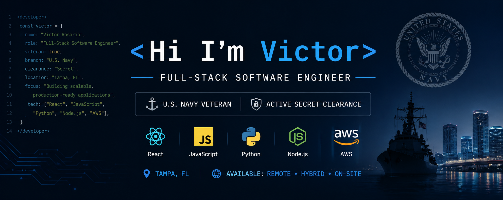

Software Engineer and U.S. Navy veteran with an active Secret Clearance and 10+ years of technical and operational experience. I specialize in full-stack development — building and deploying production-ready web applications with a focus on frontend development, RESTful API design, and clean architecture.

🌐 Portfolio: https://www.roscreations.com
📍 Tampa, FL &nbsp;|&nbsp; 🔐 Active Secret Clearance &nbsp;|&nbsp; Available remote, hybrid, or on-site

---

## 🧠 Tech Stack

  

---

## 🚀 Featured Projects

### 🌐 RosCreations – Personal Portfolio Website
React, JavaScript, HTML/CSS, Vite, EmailJS, GitHub, Vercel

Designed and built a responsive, production-ready portfolio showcasing software projects and professional background. Features animated UI components, interactive project cards, and a timeline-based experience section. Integrated EmailJS for contact form handling and deployed via GitHub CI/CD.

- 🔗 Live: https://www.roscreations.com
- Repo: https://github.com/Vros15

---

### 🔐 Password Strength Analyzer API
Python, FastAPI, REST, CORS, Render

Built and deployed a secure REST API that analyzes password strength using entropy-based scoring. Implemented input validation, rate limiting, and CORS configuration for safe public access. Integrated with a React frontend featuring visual strength indicators and crack-time estimation. Published interactive docs via OpenAPI (Swagger).

- Repo: https://github.com/Vros15/password-strength-analyzer-
- Live API Docs: https://password-strength-analyzer-pa5m.onrender.com/docs

---

### 🎮 Tic-Tac-Toe AI
React, Node.js, JavaScript

Developed an interactive browser-based game featuring a toggleable AI opponent with minimax-style decision logic and adjustable difficulty levels. Demonstrates full-stack concepts and practical problem-solving.

- Repo: https://github.com/Vros15/tic-tac-toe-react-ai

---

### 🕹️ Shaq-a-Licious (Java Game)
Java, OOP, Game Logic

Developed an interactive Java-based game applying core object-oriented programming concepts. Focused on class design, state management, collision detection, and user interaction handling.

- Repo: https://github.com/Vros15/Shaq-Game

---

## 📫 Let's Connect

---

## ⭐ About This Profile

This GitHub highlights selected projects, coursework, and experiments that reflect my growth as a full-stack engineer. Currently enrolled in Noble Desktop's Full Stack Software Engineering program — expanding expertise in React, Node.js, MongoDB, Django, Flask, and OpenAI API integration.

B.S. Computer Science — University of Maryland Global Campus (3.718 GPA)

I'm always open to collaboration, learning opportunities, and meaningful engineering challenges.
